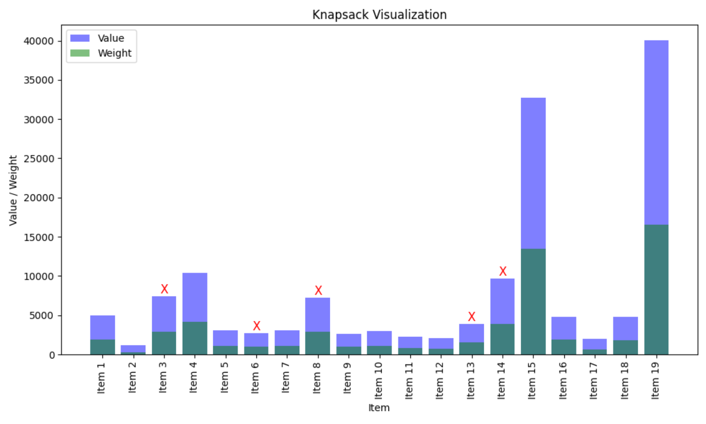
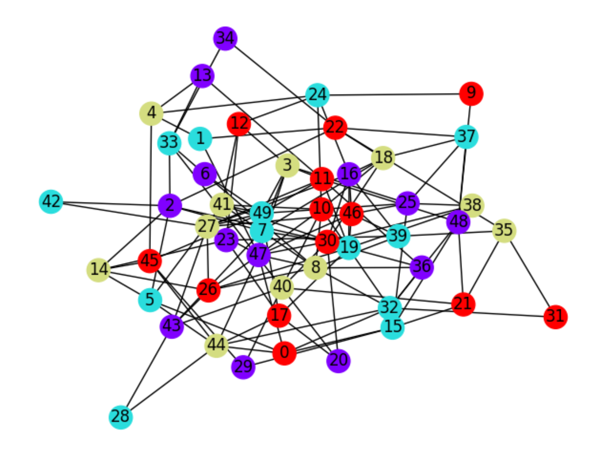
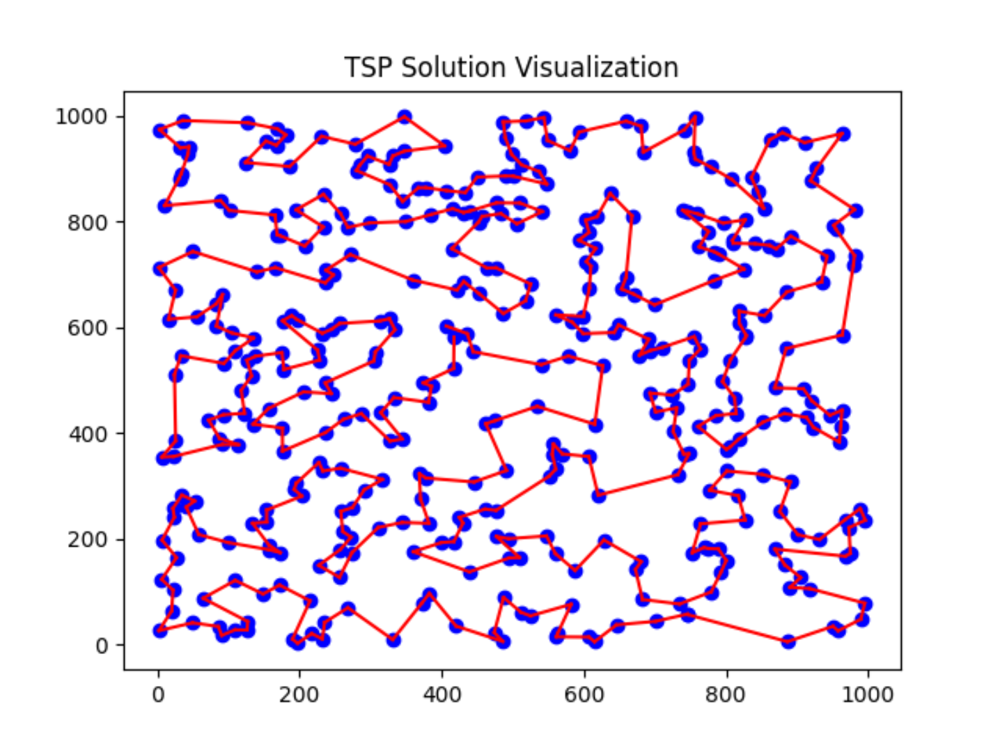
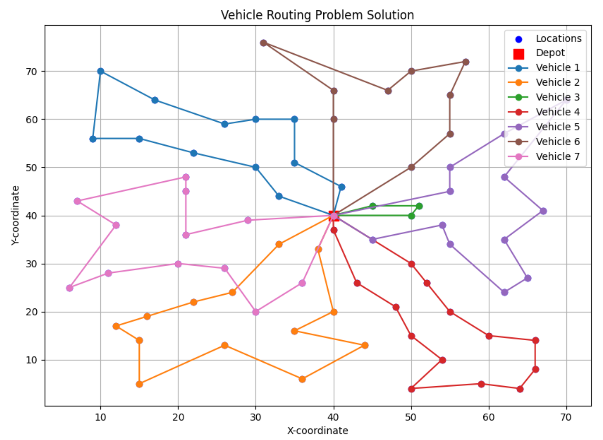
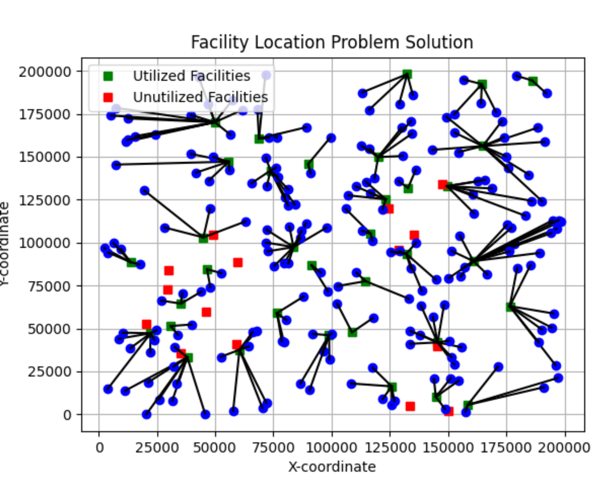

# Discrete Optimization Implementations

Welcome to the Discrete Optimization Implementations project. 
This repository contains implementations of various discrete 
optimization algorithms for solving classic problems such as 
the Knapsack Problem, Graph Coloring Problem, Traveling Salesman Problem (TSP),
Vehicle Routing Problem (VRP), and Facility Location Problem.

## Table of Contents
- [Introduction](#introduction)
- [Implementations](#implementations)
  - [Knapsack Problem](#knapsack-problem)
  - [Graph Coloring Problem](#graph-coloring)
  - [Traveling Salesman Problem (TSP)](#traveling-salesman-problem-tsp)
  - [Vehicle Routing Problem (VRP)](#vehicle-routing-problem-vrp)
  - [Facility Location Problem](#facility-location-problem)
- [Acknowledgements](#acknowledgements)

## Introduction
Discrete optimization involves finding the best solution from a finite set of possible solutions. It is a fundamental area of optimization focusing on problems with discrete decision variables. These implementations aim to provide efficient solutions to some of the most well-known discrete optimization problems.

## Implementations

### Knapsack Problem

The [Knapsack Problem](https://en.wikipedia.org/wiki/Knapsack_problem)
involves selecting a subset of items with maximum value while
keeping the total weight within a given capacity.

To solve the Knapsack Problem I used a [dynamic programming](https://en.wikipedia.org/wiki/Dynamic_programming)
approach that involves iteratively building up a memoization table 
to store the solutions to sub-problems. At each step, it considers
whether to include the current item in the knapsack or not, 
updating the table based on the maximum value achievable with 
the remaining capacity and items. By iteratively filling up 
the table, ir eventually determines the optimal solution, 
which represents the maximum value that can be achieved with 
the given capacity and set of items. This approach ensures 
efficiency and guarantees an optimal solution.

A visualized solution of 19 items is displayed below. 
Selected items are labeled with **X**.

### Graph Coloring Problem

[Graph Coloring](https://en.wikipedia.org/wiki/Graph_coloring) is 
the problem of assigning colors to the vertices of a graph such 
that no two adjacent vertices share the same color.

[Constraint programming](https://en.wikipedia.org/wiki/Constraint_programming)
offers an effective approach to solve the Graph Coloring Problem 
by framing it as a constraint satisfaction problem. In this approach, 
each vertex in the graph represents a variable, and the goal is 
to assign each vertex a color from a given set of colors such 
that no adjacent vertices share the same color. Constraints are 
then formulated to enforce this condition, ensuring that adjacent 
vertices have different colors. By leveraging constraint propagation 
techniques and backtracking search algorithms, constraint programming 
systematically explores possible color assignments while satisfying 
the constraints, ultimately finding a valid coloring solution. This 
approach provides a flexible and efficient method to tackle the 
Graph Coloring Problem, particularly for large and complex graphs, 
where traditional algorithms may struggle to find optimal solutions.

A visualized solution of 50 nodes is displayed below. 4 colors were used.

### Traveling Salesman Problem (TSP)
The [Traveling Salesman Problem](https://en.wikipedia.org/wiki/Travelling_salesman_problem) 
requires finding the shortest possible route that visits each location 
exactly once and returns to the initial location.

To solve the Traveling Salesman Problem (TSP), I utilized a 
combination of techniques to efficiently find high-quality solutions.
I first employed [Christofides' algorithm](https://en.wikipedia.org/wiki/Christofides_algorithm) 
to obtain an initial solution. Christofides' algorithm is an 
approximation algorithm that guarantees a solution within a 
factor of 3/2 of the optimal solution for metric TSP instances. 
This provided a reasonably good starting point for the optimization 
process. Subsequently, I applied [Tabu Search](https://en.wikipedia.org/wiki/Tabu_search)
to further refine the initial solution and improve its quality. 
Tabu search is a metaheuristic algorithm that iteratively explores 
the solution space by making small modifications to the current 
solution and selectively accepting or rejecting these changes 
based on certain criteria. By leveraging this hybrid implementation 
I was able to achieve solutions that were both efficient and of 
high quality for the given TSP problem.

A visualized solution of 400 locations is displayed below.

### Vehicle Routing Problem (VRP)
The [Vehicle Routing Problem](https://en.wikipedia.org/wiki/Vehicle_routing_problem) 
deals with determining optimal routes for a fleet of vehicles to 
visit a set of locations, minimizing total distance traveled.

To solve the vehicle routing problem I used a combination of 
constraint programming and local search techniques.  In this 
approach, the decision variables represent the sequence of 
customers visited by each vehicle and enforce constraints to
ensure that the vehicle capacities are not exceeded and each 
customer is visited exactly once. Then a routing solver employs 
[local search algorithms](https://en.wikipedia.org/wiki/Local_search_(optimization))
to iteratively improve the solution by exploring neighboring 
solutions in the search space. By adjusting solver parameters 
such as the first solution strategy and local search metaheuristic, 
high-quality solutions can be found within a specified time limit. 
Overall, this approach combines the flexibility of constraint 
programming with the efficiency of local search to efficiently 
solve the vehicle routing problem and find optimal or near-optimal 
solutions.

A visualized solution of 7 vehicles and 76 locations is displayed below.

### Facility Location Problem
[The Facility Location Problem](https://en.wikipedia.org/wiki/Facility_location_problem) 
aims to find the optimal locations for facilities 
(such as warehouses or factories) to serve a set of demand 
points while minimizing costs.

To solve this problem I used Mixed-Integer Programming (MIP) 
techniques. MIP formulates the problem as a mathematical 
optimization model where decisions are made regarding which 
facilities to open and which customers to assign to each facility. 
The model captures the problem's constraints, such as facility 
capacities, customer demands, and assignment restrictions, 
as well as the objective of minimizing total costs, including 
setup costs and transportation distances. The solver explores 
the solution space systematically, leveraging sophisticated 
algorithms like branch-and-bound and cutting planes to find 
the optimal or near-optimal solution. Additionally, constraints 
are added to ensure that each customer is served by at least 
one facility and that facility capacities are not exceeded. 
The solver iteratively refines its search, balancing computational 
resources and solution quality, ultimately delivering an 
efficient and effective solution to the facility location problem.

A visualized solution of 50 facilities (35 utilized) and 200 locations is displayed below.

## Acknowledgements

I would like to express my gratitude to Coursera and the 
University of Melbourne for offering the course that inspired and guided 
the development of this project. The concepts and techniques learned 
throughout the course provided the foundation for the implementations 
presented here. Special thanks to the instructors, course staff, 
and fellow learners for their valuable insights, feedback, and support 
during the learning journey.